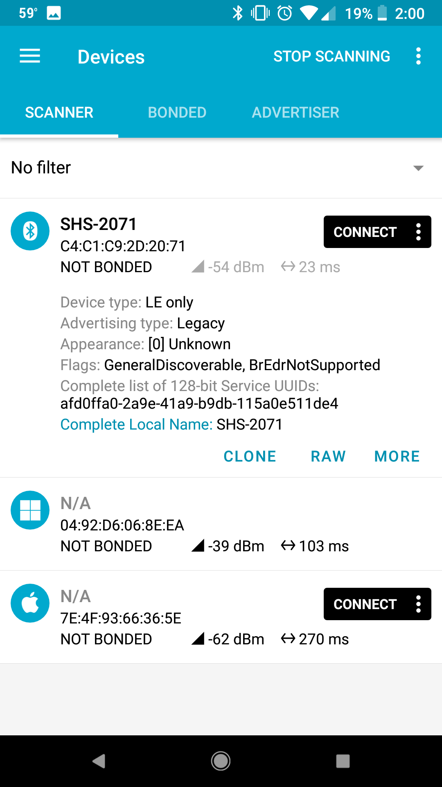
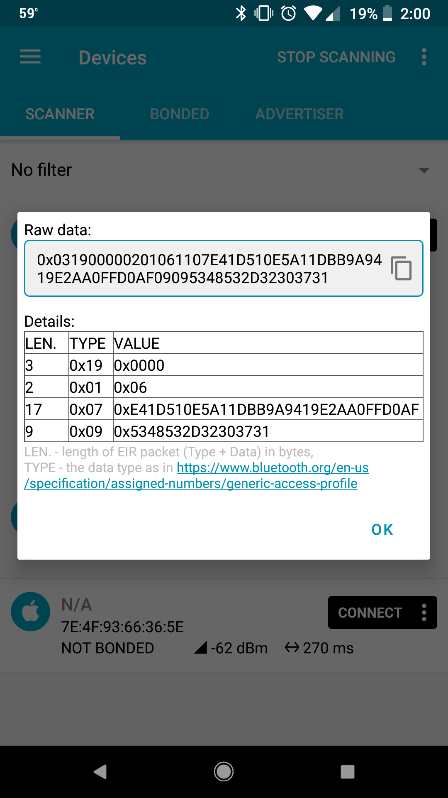
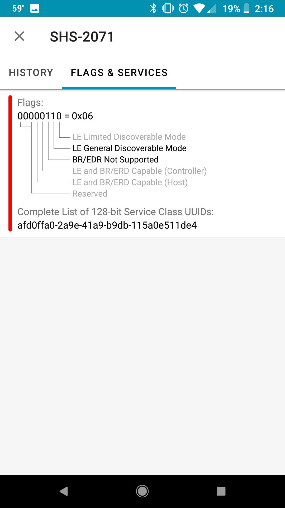
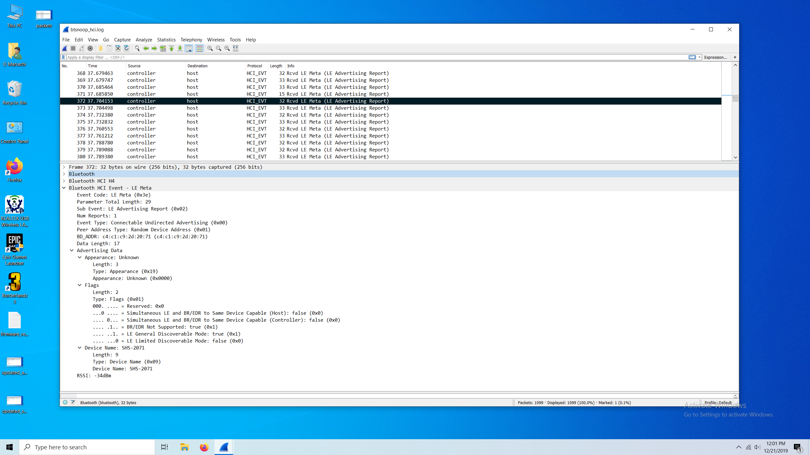
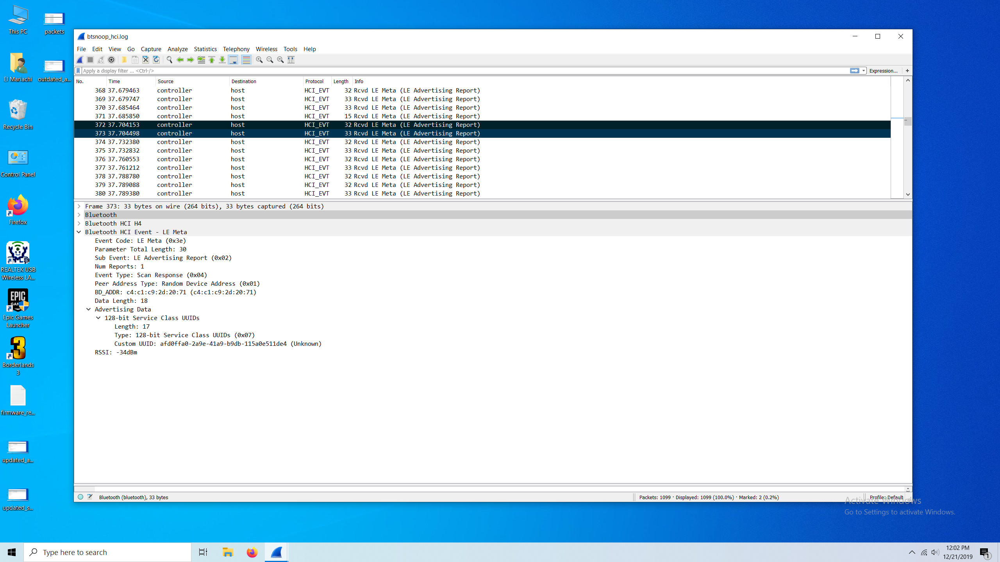
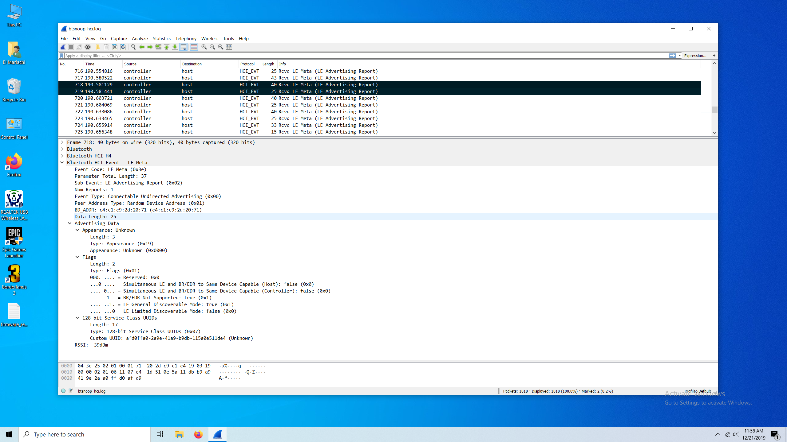
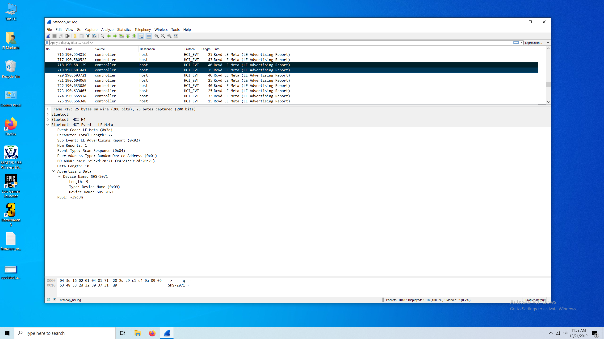

# iOS - Scan and Connect to a BLE peripheral in the background

## Use Case

Our goal is to scan and connect to a BLE peripheral with an iOS app running in the background.  In this case that BLE peripheral is a smart sensor for a cycling helmet called ANGi.  The ANGi sensor will detect an impact and then the app will alert your emergency contacts of the accident with details about your location and when the crash occured.  The user might start their bike ride before the sensor has been enabled (shake to wake) so we would like our iOS app, the [*Ride App by Specialized*](https://apps.apple.com/us/app/specialized-ride/id1374601630), to scan and connect to the ANGi if the app has been backgrounded by the user.

More information about ANGi is available here:
https://www.specialized.com/us/en/stories/angi

## Connecting to a device while the app is in the background

Apple's official introduction to Core Bluetooth background processing can be found [at this link](https://developer.apple.com/library/archive/documentation/NetworkingInternetWeb/Conceptual/CoreBluetooth_concepts/CoreBluetoothBackgroundProcessingForIOSApps/PerformingTasksWhileYourAppIsInTheBackground.html) and the developer documentation is [here](https://developer.apple.com/documentation/corebluetooth). The documentation states that an app that wishes to discover and connect to a BLE peripheral while in the background must declare the correct background mode and scan for the desired service by service UUID.

### Declare the correct background mode

The "Uses Bluetooth LE accessories" background mode needs to be enabled in Xcode for your app to perform Bluetooth related tasks in the background. As stated by Apple:

> While your app is in the background you can still discover and connect to peripherals, and explore and interact with 
> peripheral data. In addition, the system wakes up your app when any of the CBCentralManagerDelegate or CBPeripheralDelegate 
> delegate methods are invoked, allowing your app to handle important central role events, such as when a connection is
> established or torn down, when a peripheral sends updated characteristic values, and when a central manager’s state changes."

### Scan for device by Service UUID

The Apple documentation states that applications are allowed to scan while backgrounded but the scan must specify the service types.  Passing nil to perform a wild card scan is not supported in the background.

```
public struct ImpactService {
    public static let service = CBUUID(string: "AFD0FFA0-2A9E-41A9-B9DB-115A0E511DE4")
}

centralManager.scanForPeripherals(withServices: [ImpactService.service], options: scanOptions)
```

## It is not working.  Why not?

We have followed Apple's suggestions that should enable us to discover our BLE peripheral while our app is in the background, but we are unable to discover the device.  This situation is especially interesting because our Android devs are able to accomplish this task. Is the problem with our iOS implementation or with the device? 

## Inspecting the advertisement data with nRF Connect

One of the best tools we have for viewing bluetooth data is nRF Connect - for Android. The Android version of the app is much more fully featured than its iOS counterpart. Upon kicking off a scan with nRF Connect, we see the following:



The first item in the list is the ANGi device that we are looking for. We see some interesting information that is given to us during the scan, including the device name (SHS-2071), and our Service UUID (afd0ffa0-2a9e-41a9-b9db-115a0e511de4). We can tap on 'RAW' to check out the raw data being returned to us.



Ok, this looks interesting, but what does it all mean? Let's follow the [link that nRF Connect provides](https://www.bluetooth.com/specifications/assigned-numbers/generic-access-profile/) in that screen.

## Interpreting the advertisement data

That link sends us to a page that describes the Generic Access Profile Bluetooth specification. We find out that the 'type' column in the screen shot corresponds to the following:

- 0x19 - Appaerance
- 0x01 - Flags
- 0x07 - 128-bit Service Class UUIDs
- 0x09 - Complete Local Name

The value for the `Appearance` type is `0x000` - it is completely empty. The value for the `128-bit Service Class UUIDs` type is a hexadecimal representation of our service UUID. The value for the `Complete Local Name` type is `0x5348532D32303731` which translates to `SHS-2071` if passed through a hexadecimal to ASCII converter. What does `0x06` mean for the `Flags` type? Luckily, nRF Connect provides us with that data:



Everything appears to look good. We are advertising our service UUID. So why can we not connect to our device while the app is in the background? Are the flags problematic? We ended up finding another BLE device that advertised the same flags and we were able to successfully discover the device while performing a background scan, so that ruled out that theory.

## nRF Connect does not tell the whole story - digging into the packets

Our lack of familiarity with the Bluetooth protocol was proving to be a limiting factor. Luckily, our firmware engineer had tools that he could use to look at the individual packets being exchanged between the Bluetooth central device (the phone) and the peripheral (the ANGi).  Ultimately he found that the Service UUID was not included in the advertisement packet, but in the Scan Response packet. Aha! This is a promising lead.

It is also possible to sniff the packets with a phone that has Android 4.4+ installed. For example, [this link](https://stackoverflow.com/questions/49287985/bluetooth-hci-snoop-log-not-generated-pixel-2/49287986) describes how to collect the data packets with a Google Pixel. In short, you must enable bluetooth logging and then kick off processes that utilize bluetooth - in our case, using nRF Connect to scan for our ANGi device. This generates a `btsnoop_hci.log` file that we can inspect with Wireshark. Let's take a look at what these advertisement packets look like with Wireshark.

The phone collects quite a bit of data, so you will have to sift through it to find what you are looking for. We are looking for the advertisement data for our ANGi device. We find it at this packet here:



We can see that the `Event Type` is listed as `Connectable Undirected Advertising`. This is the advertising packet that our ANGi device is broadcasting. This advertising packet includes the `Appearance`, `Flags`, and `Device Name`. Where is the Service UUID?

It turns out that it is in the next record in Wireshark:



This packet's `Event Type` is `Scan Response`. This includes our Service UUID.

So it turns out that the raw data that we received in nRF Connect is actually a combination of the data from the Advertising and Scan Response packets.

## Active vs Passive scanning

This information helped us locate the [following Apple Developer post](https://forums.developer.apple.com/message/189093#189093) which describes some important undocumented behavior of iOS devices; iOS devices perform Active scanning while in the foreground and Passive scanning while in the background. [This page](http://dev.ti.com/tirex/content/simplelink_academy_cc2640r2sdk_1_12_01_16/modules/ble_scan_adv_basic/ble_scan_adv_basic.html) provides a good description of the difference between Active and Passive scanning:

> When not connected, Bluetooth devices can either advertise their presence by transmitting advertisement packets or scan for nearby
> devices that are advertising. This process of scanning for devices is called device discovery. There are two types of scanning; active > and passive. The difference is that an active scanner can send a scan request to request additional information from the advertiser,
> while a passive scanner can only receive data from advertising device. Note that the terms discovery and scanning may be used
> interchangeably. The figure below shows the sequence where the scanner sends a scan request to an advertiser during an advertising 
> event.

In other words, while the iOS device is in the foreground and Actively scanning, it will receive Advertising packets, send out Scan Requests, and receive Scan Response packets. In the background, the iOS device will only receive Advertising packets. Since our ANGI's Service UUID is in the Scan Response, we finally have an explanation as to why we can discover other BLE devices while backgrounded but not our ANGi.

## Fixing the problem!

So, it sounds like all we need to do is put our Service UUID in the advertisement packet. Is it that easy? Almost, but not quite. The advertisement packet has a maximum length of 31 bytes. [This post](https://devzone.nordicsemi.com/f/nordic-q-a/14/what-s-the-maximum-size-for-an-advertisement-package) describes the constraints:

> An advertising packet can be up to 31 bytes of data. Each field (i.e. appearance, name, service UUID or similar) have a header of 2 
> bytes (length and type), meaning that the maximum user payload is 29 bytes.

So rather than just moving our Service UUID into the Advertising packet which already includes the Flags, Apperance, and Local Name, we decided to move the Service UUID into the Advertising packet and move the Local Name to the Scan Response.

Once that change was made...it worked! We were now able to successfully connect to our device while our app was in the background.

After that change, here is how the raw advertisement data looks in nRF Connect:


It looks the same! This is because nRF Connect is performing an Active scan and is combining the data from both the Advertisement data packet and the Scan Response data packet. 

Here is how the Advertisement data packet now looks with the Service UUID included:



And here is how the Scan Response data packet looks with the Device Name:



## In Summary

If you wish to discover a BLE peripheral while your app is in the background, you must be sure to declare the correct background modes, scan for the desired by service UUID, and ensure that the BLE peripheral declares the service UUID in the advertising packet rather than the scan response packet.


